# The Biological Records Tool for QGIS

The main purpose of the Biological Records Tool is to allow you to take a spreadsheet of biological records and map them in QGIS, either as points for individual records, or by aggregating records by OS grid squares. The aggregating feature can also be used on an existing point layer rather than a spreadsheet of records. Since version 3.2 you are also able to generate 'source layers' from a direct connect to a Recorder 6 database. To start the Biological Records Tool, click the relevant button on the FSC QGIS plugin toolbar. By default, the biological records tool docks initially at right of the QGIS window.

Mapping individual records from CSV files

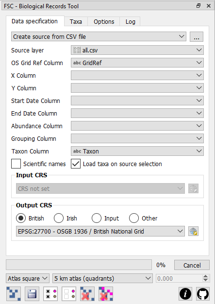The first step in using this tool with a spreadsheet of records is to open the spreadsheet to create a new source layer from which map layers can be created. In the drop-down list at the top of the tool, ensure that the create source layer from CSV file option is selected and then click the browse button to the right of it ([...]). In fact, the tool can only open Comma Separated Value (CSV) files, so you must first save your spreadsheet as a CSV file if you are working with another format like Excel for example.

Once the CSV is opened, it will be represented by an item in the source layer drop-down list. This drop-down list shows all CSV files that have been opened plus any point vector layers or memory layers created from Recorder 6. (See next sections on working with point layers and Recorder 6.) At this point you can also use QGIS' attribute table tool to view the data in the CSV if you wish.

You must set the value of the drop-down list OS grid ref column to the name of the column in your spreadsheet that contains the OS grid reference (or Irish grid reference). Alternatively, if your spreadsheet contains eastings/northings, or long/lat, values, then specify the relevant fields using the x column and y column drop-down lists.

If you are specifying an easting/northing (or long/lat), then you must set the input CRS to indicate the CRS used to encode the data in your data source. If you have specified a grid ref column, then the tool will work out whether each of the grid references it encouters is a British or Irish grid reference and interpret it accordingly. You must also specify an output CRS for the map layers you created. For convenience there are British and Irish radio buttons to set corresponding CRSs quickly. If you want to match the output CRS to an input CRS you have specified, then select the input option. For any other CRS, select the other option and then specify the output CRS using the selection button below the options.

If the value of the second drop-down list at the foot of the tool (referred to as the aggregation drop-down) is set to records as points (the default), then clicking the create map layer button creates a new map layer with a point for every record in the spreadsheet. Each point is located at the centre of the grid reference square represented by the associated grid reference.

The records as grid squares option in the aggregation drop-down also results in individual records being represented in the output map layer, but instead of generating a point for each record the tool will generate a polygon representing the square corresponding to the grid reference for each record. It's a handy way of visualising data encoded with grid references of varying levels of precision. This option can only be used if the records in the input spreadsheet are geocoded with OS grid references.

When you map individual records in the ways described above, columns in the spreadsheet are represented by attributes in the new map layer and you can use the identify features tool or the the attribute table tool to see the attribute value behind each record.

Working with point layers

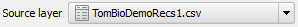Instead of using a CSV file as a source layer, you can use a point layer. This is useful if you have a source of biological records already expressed as a GIS point layer rather than a spreadsheet. The name of any open point layer is represented in the source layer drop-down list (along with any open CSV files). When you select a point layer from this list, you do not need to specify a grid-reference or x/y columns since the location of the biological records is represented by the location of the points themselves.

Working with Recorder 6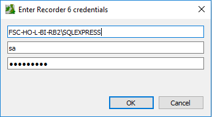

If you set the value of the top drop-down list to Create source from R6 database then when you click the browse button to the right of this ([...]) the tool will first attempt to connect to the Recorder 6 DB using a SQL Server 'trusted connection'. If it cannot do this then it presents a dialog into which you can enter your recorder 6 login credentials.

If the plugin can retrieve the name of the server from the Recorder 6 Windows registry entries, then this will already be filled in for you. The username and password you supply here must be that for a user that has permission to log in to SQL Server remotely.

Once you have successfully established a connection to the Recorder 6 database, you will see another dialog where you can specify the taxon you wish to search on.

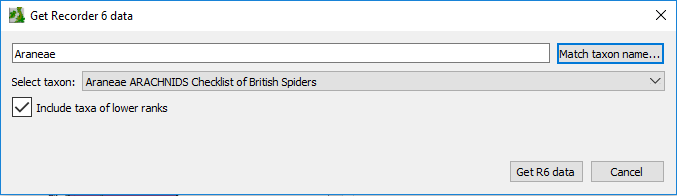

Using this Recorder 6 link you can generate datasources from the Recorder 6 database. Enter a search term for a taxon and either hit the return key on your keyboard or click the Match taxon name... button. All matches for your search term will be presented in the drop-down list opposite Select taxon. Select the taxon you want to generate a datasource for and then click Get R6 data. If you have selected a higher-order taxon (e.g. a taxon of higher rank than species like that shown in the example) and check the Include taxa of lower ranks checkbox, then records for all taxa below that selected will be included in the generated source layer. The plugin will generate a QGIS memory layer representing the R6 records for the selected taxon and you will be able to select this in the source layer drop-down in the tool. From thereonin it's just like using a CSV layer in the tool. (Note that in QGIS's layers panel the memory layer from R6 looks very much like a layer created directly from a CSV file.)

Aggregating records (atlas maps)

Records can be aggregated by grid square to create 'atlas' type maps. If the output CRS is set to British or Irish national grids, then you can select any of the following aggregation levels from the aggregation drop-down:

- 1 m squares (10-figure grid ref)

- 10 m squares (8-figure grid ref)

- 100 m squares (6-figure grid ref)

- 1 km squares (monad grid ref)

- 2 km squares (tetrad grid ref)

- 5 km squares (quadrant grid ref)

- 10 km squares (hectad grid ref)

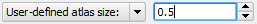If you set any other CRS, to aggregate records you must select the user-defined atlas size option and specify a grid size. The grid size is specified in the control immediately to the right of the aggregation drop-down in map units corresponding to the output CRS. So if the CRS specifies map units in decimal degrees (long/lat) then you specify a grid size in degrees (e.g. 0.5), whereas if your CRS specifies map units in metres then you also specify a grid size in metres (e.g. 10000).

Setting the aggregation options as described above and then clicking the create map layer button results in a new map layer, but instead of a point (or square) in the new map layer for every record in the input spreadsheet, you only get one single polygon at each cell of the specified grid where a record occurs. The cell is represented by either a square or a circle depending on the value you set in drop-down list to the left of the aggregation drop-down. The default is atlas squares but you can change it to atlas circles.

Because records are aggregated in these atlas maps, the original attribute values for individual records are not preserved. Instead atlas maps created with this tool have the following attributes:

- GridRef. This is a text-type attribute which specifies the grid reference (if the output CRS is British or Irish national grid). If an easting/northing was used to georeferenced the records, then instead of the grid reference, then this field contains the easting/northing (or long/lat) separated by a '#' character.

- Records. This is numeric attribute which stores the number of records in the input spreadsheet which fall within this grid square.

- Abundance. This is a numeric attribute which indicates the abundance associated with each grid square. By default, this is the same as the records attribute, but if a column is specified by the abundance column drop-down list, then this attribute will contain the sum of the values of this column for all records in the spreadsheet which fall within this grid square. If, for any record, no value is specified in this column, then an abundance of 1 is assumed for that record.

- Richness. This is a numeric attribute that indicates the number of different taxa represented by records in the input spreadsheet which fall within this grid square. (See next section to understand this fully.)

- FirstYear. If you sepecify a start date column and/or an end date column then this field will contain the year of the earliest record that was aggregated in the grid square. You can select columns which contain, full dates or partial dates or even date ranges. The plugin will simply look for four digit numbers within these fields and treat them as years. (See also note below.)

- LastYear. If you sepecify a start date column and/or an end date column then this field will contain the year of the latest record that was aggregated in the grid square. You can select columns which contain, full dates or partial dates or even date ranges. The plugin will simply look for four digit numbers within these fields and treat them as years. (See also note below.)

- Taxa. This is a text attribute that indicates the different taxa represented by records in the input spreadsheet which fall within this grid square. The name of each taxon is separated by a '#' symbol. (See next section to understand this fully.) Note that the size limit for a text attribute is 255 characters, so if there are more than just a few taxa, this can get truncated.

If your input data contains a single date (or year) column, then you can just select this in starte date column. The plugin will treat all the records as if they are confined to a single year (as most are), but will still discern both FirstYear and LastYear for the aggregated data. Generally you will only need to specify a value for end date column if your input data contains two separate columns for start and end dates to denote a date range. If you do this and one of the columns (e.g. end date column) is empty for any records, it won't matter - the plugin will treat the record as if it were confined to a single year. If your input data contains a single column which can contain date ranges, then you can specify this as the start date column - the plugin will always look to see if it can find both a start and end year in the data even in a single column.

Sometimes individual records in a spreadsheet geocoded with OS grid references might be too coarse to be used in a map aggregated at a finer scale. For example in a spreadsheet with records of mixed precision being aggregated at monad (1 km square) level, then all records at a coarser precision (tetrad, quadrant or hectad) will not be used in the aggregation. When this happens, those records 'missed out' are logged on the log tab of the tool.

Working with taxa

All of the functions described thus far could be used to map spreadsheets of anything – whether biological records or locations of public houses – the only requirement is a spreadsheet with a column for grid reference (or easting/northings or long/lats), or a point layer. But the Biological Records Tool has other capabilities that are geared specifically to biological records. Chief amongst these is the ability to specify a column that identifies different taxa (e.g. species) in the spreadsheet (or point layer) and thereafter map each taxon separately if desired.

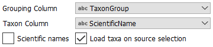Setting the taxon column enables these features. When this column is set, you need to tell the tool which taxa to deal with when creating maps. You do this from the Taxa tab. If the Taxon column is a name recognised by the tool (see section on environment options) and the Load taxa on source selection box is checked, then the 'taxon tree' on the taxa tab will be generated automatically. Otherwise you must click the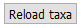Reload taxa button to generate it once the Taxon column is set. The taxon tree lists all the individual taxa found in the source data and makes them individually selectable. The map creation functions detailed in the previous sections will only operate on records for which taxa have been selected in this list.

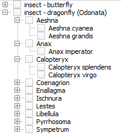If the taxa listed in the taxon column are scientific binomials, the tool will treat them as such if you check the scientific names checkbox. When this is checked then taxa of the same genus listed in the taxon tree are grouped under an item representing the genus.

Furthermore, if you have a column in the spreadsheet which groups taxa at some other level (e.g. family) then you can specify this in the grouping column drop-down and taxa will also be grouped under items representing different values of this.

The example here shows the setup for a CSV file that has a column called Taxon which has scientific names. Another column called TaxonGroup indicates whether the taxon is a butterfly or a dragonfly. The resulting tree is also shown with some items expanded. In this tree an individual species could be selected by checking the box next to its name. All species in a genus could be selected by checking the box next to the genus name. All species in a group (here either butterflies or dragonflies) could be selected by checking the box next to the group.

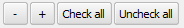For convenience, the tool has a couple of buttons for unchecking or checking all items in the taxon tree – check all and un-check all – and two buttons to the left of these allow you to expand the entire tree (the + button) or contract the entire tree (the – button).

When working in single map mode (see next section for more information) and more than one taxon is selected (or when the taxon column is not specified), the single map layer created when records are mapped (as appears in the layers panel) is given name based on the filename of the entire spreadsheet. But when a single taxon is selected, then name of the map layer is based on the name of the taxon and, for aggregated maps, the level of aggregation.

Working in batch mode

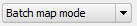Thus far we've only talked about generating one map layer at a time, but when working with spreadsheets that have a taxon column specified, we can instruct the biological Records tool to generate separate maps for each selected species rather than a single map for them all. To do this change from single map mode to batch map mode on the options tab.

When batch map mode is specified then a separate map layer is created for each taxon checked in the taxon tree when the create map layer button is clicked. This can lead to a great many layers being created on one click – for example in a spreadsheet with 400 taxa, checking all taxa in the taxon tree and then clicking the create map layer button will create 400 map layers and list them all in the layer panel. By default these will all be checked in the layers panel – meaning they will all be displayed in the map view. If you want to see one of them on its own, you would need to uncheck the other 399! 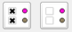This would be extremely tedious so there is a convenience button – hide all generated map layers – to un-check them all. There is also a corresponding button – show all generated map layers – to check them all.

The tool is designed to allow you to generated map layers from an underlying spreadsheet really quickly. You will often find that you want to delete generated layers – perhaps because you've made a mistake or perhaps you just want to remove them from the layers panel and the map view.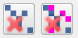The left-most of the two delete buttons – remove last map layer – allows you to delete the last layer created by the tool. The one on the right – remove all map layers – allows you to delete all layers created by the tool in the current session.

By default, QGIS assigns each newly created map layer a random single symbol style. If you are creating many maps, perhaps hundreds at a time for an atlas project, you will likely want each map to conform to a certain style. Once a style – perhaps a complex style – is developed for a layer, it can be saved independently of the layer as a 'QML' file.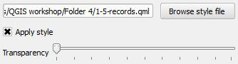You can tell the biological recording tool to apply an external style file to each new layer it creates using by specifying the path to the external style file – use the browse style file button on the options tab to locate the style file – and checking the apply style checkbox.

The transparency slider immediately under these controls can be used to set the layer transparency at the point of creation. Remember, all of these style settings can be set on a layer after creation, but if you are generating many layers, it can be much more convenient to set them when they are created.

Batch map image generation is occasionally slow with certain backgrounds - e.g. somtimes when using a particular WMS (web mapping service) to provide background mapping. If you are finding map or image generation slow, use this workflow: first get your map background just right (using WMS if you like) and then use the QGIS facility to save the map as a raster image. Now turn off all your background layers and load the single raster image you just created - it will look exactly the same but will avoid calls to WMS during map and image generation.

If you are generating very large numbers of map layers, the progress bar may freeze, but the function is unaffected.

Output options

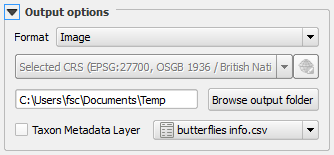Map layers generated by the Biological Records Tool are temporary layers - known in QGIS' vocabulary as 'memory layers'. These temporary layers do not persist from one QGIS session to the next unless you specifically save them as permanent layers. So, for example, if you save a project which contains one or more of these temporary layers, when you open the project again, the layer names will appear in the QGIS layers panel, but the data will be missing from the map view. To make it easy to recognise these layers, the Biological Records Tool always prefixes the name of the layers with 'TEMP'.

Once a series of map layers has been created, it is possible to generate a series of bitmap images – one for map layer generated by the tool – each showing all displayed background layers (i.e. all open layers except those generated by the tool) and just one layer generated by the tool. Do this with the save images for all map layers button. This is good for generating maps for an online atlas for example. The generated map images are saved to the image folder specified on the options tab – use the browse image folder button to locate the image folder.

The Biological Records Tool gives you several ways of persisting the data in these temporary layers. The format drop-down list in the output options (options tab), lists the different methods of saving the layers.

- Image. Use this option to generate a series of image files – one for temporary layer generated by the tool – each showing all displayed background layers (i.e. all open layers except those generated by the tool) and just one layer generated by the tool. The images are generated directly from the QGIS map view.

- Shapefile. Use this option to generate a permanent shapefile for each temporary layer generated by the tool.

- GeoJSON. Use this option to generate a permanent GeoJSON file for each temporary layer generated by the tool.

- Composer image. Use this option to generate a series of image files – one for temporary layer generated by the tool – each showing all displayed background layers (i.e. all open layers except those generated by the tool) and just one layer generated by the tool. The image files are generated from a map composer.

- Composer PDF. This option is the same as the previous one except that instead of producing image files, it produces PDFs.

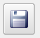Once an option is selected in the format drop-down list, use the save button to save the layers or images into the folder that you have specified using the browse output folder button.

The Shapefile is for making permanent shapefiles from your temporary layers. Once used, you can clear all the temporary layers using the delete all button and then open the permanent vector layers if you wish. The GeoJSON option is great for saving layers that can be used on the internet, for example with OpenLayers javascript library. For both these options, the CRS of the layers produced is specified using the CRS selection. This means that you can save the permanent layers with a different CRS to that used for the temporary layers if you wish. Again, this can be useful for saving layers to use with libraries like OpenLayers that want GeoJSON layers to be project in WGS84 for example.

If using either of the two options that use a map composer, you must open the composer that you wish to use. Any text items in the composer are searched for the token '#name#' and this is replaced with the name of the taxon derived from the name of the temporary layer. Other replaceable tokens can be defined in a CSV file and then used in the map composer in the same way as the '#name#' token. The name of any special token used must match a column header in the CSV file. The value used to replace the special tag - e.g. '#CommonName#' - will be the values corresponding to the column (e.g. 'CommonName') and row for the taxon.

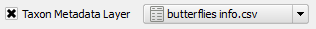The illustration below shows a CSV file defining metadata for butterflies. The CSV must contain a column called 'Taxon' which contains the names of the taxa (these must match the names that would be derived for the '#name#' token). The CSV file can be created in a program such as Excel. Before it can be used as a taxon metadata layer, it must be opened as a no geometry CSV layer in QGIS. The easiest way to do that is to open it using the create new source layer from CSV button on the Biological Records tool. Then select it in the taxon metadata layer from the drop-down list in the output options and check the box next to it as shown in the illustration on the right.

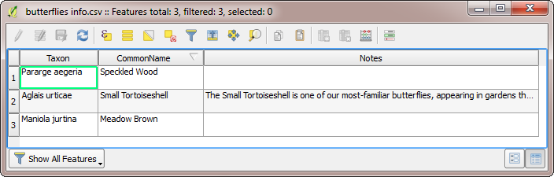

If the CSV file shown above were used as a taxon metadata layer, then any '#CommonName#' tokens in the composer would be replaced by the values in the 'CommonName' column for each corresponding taxon. Similarly, and '#Notes#' tokens in the composer would be replaced by the text in the 'Notes' column corresponding to the taxon. In this example, a '#Notes#' token would be replaced by text for Small Tortoiseshell and would simply be removed for the taxa without any value specified in the 'Notes' column. Text values do not have to be limited in length, so substantial amounts of text can be used to replace a token if desired.

Getting help and support

There are two links at the bottom-right of the tool (shown on the left here). The first links straight from the tool to this web page showing help on how to use the tool. The second link goes straight to the GitHub repository for the FSC QGIS Plugin where you can raise issues about problems, bugs, feature requests etc.

[(Back to help homepage)](./intro.md)
