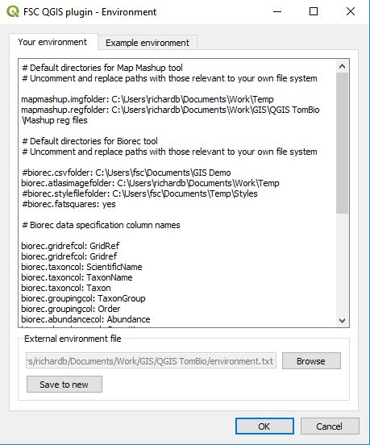

# QGIS plugin environment options

You can set a number of environment options to increase the ease of use and, in some cases, change the behaviour of the FSC QGIS plugin.

To set or change environment options, start the environment options dialog by selecting plugins>FSC tools>environment options. In the your environment tab you can specify one or more options as illustrated below. Examples of many of these can be seen on the example environment tab.

Options are specified by indicating their name, e.g. biorec.gridrefcol, followed by a colon and a space and then the value of the variable. Any line in the options file which starts with the hash symbol (#) is treated as a comment.

Tip: By default the file which records your environment options is stored in the software folder which means it gets overwritten every time the Tom.bio plugin is updated. To avoid this, you can use the save to new button at the foot of the your environment tab to save the options to a file somewhere else on your file system. Then, when you update the software, you can use the browse button to set the environment options from this file.

Biological Records Tool

The biorec.csvfolder variable can be used to specify a path to a folder which is the default used when you use the Browse button to locate a CSV file.

The biorec.atlasimagefolder variable can be used to specify a default path to the folder used for map images generated. Setting this saves you from having to re-specify it each time you open the tool.

The biorec.stylefilefolder variable can be used to specify a path to a folder which is the default used when you use the Browse to style file button to locate a style file.

The biorec.gridrefcol variable indicates the name of a spreadsheet column which will be recognised as a column specifying a grid reference and automatically selected by the tool.

The biorec.taxoncol variable indicates the name of a spreadsheet column which will be recognised as a column specifying a taxon and automatically selected by the tool.

The biorec.groupingcol variable indicates the name of a spreadsheet column which will be recognised as a column specifying a grouping column and automatically selected by the tool.

The biorec.abundancecol variable indicates the name of a spreadsheet column which will be recognised as a column specifying an abundance column and automatically selected by the tool.

The biorec.datestartcol variable indicates the name of a spreadsheet column which will be recognised as a column specifying a start date column and automatically selected by the tool.

The biorec.dateendcol variable indicates the name of a spreadsheet column which will be recognised as a column specifying a start date column and automatically selected by the tool.

Note that you can specify any of the above four column variables more than once to allow for spreadsheets of different naming conventions.

If the biorec.scientificnames variable is set to true, then the Scientific names checkbox will be checked by default.

If the biorec.outtrim variable is set to true, then GeoJSON atlas layers generated by the tool will have the Richness, FistYear, LastYear and Taxa fields removed in the interests of saving space for layers used over the internet.

The biorec.r6SQLServer variable allows you to set a value for a Recorder 6 server that will be used by default when you connect to a Recorder 6 source.

The biorec.r6SQLServerUserName variable allows you to set a value for a Recorder 6 server username that will be used by default when you connect to a Recorder 6 source.

The biorec.r6SQLServerPassword variable allows you to set a value for a Recorder 6 server user password that will be used by default when you connect to a Recorder 6 source. This is stored in plain text and is insecure.

The biorec.xGridOffset and biorec.yGridOffset variables allow you to set an offset for the origin of altas maps. Offsets are specified in the map units of the current map view CRS. Note that these variables are also used by the OSGR Tool to offset user-generated grids. An example of the kind of situation where this can be useful is in Luxembourg where biological records atlas maps are commonly made on a 5 km grid offset from the standard EPSG:2169 CRS by 3000 (easting) and 4000 (northing).

OSGR Tool

The biorec.xGridOffset and biorec.yGridOffset - allow grids to be offset from the origin of the current map view CRS (see Biological Records tool for more).

Map Mashup Tool

The mapmashup.imgfolder variable can be used to specify a default value for the path to a folder which is that used to load images from with the paste most recent image from image folder button.

The mapmashup.regfolder variable can be used to specify a default value for the path to a folder where you keep your world files. The files in this folder are used to populate the world file drop-down list.

NBN Tool

The nbn.downloadfolder variable can be used to specify a default location for the folder where data downloaded from the NBN Atlas are saved. Setting this saves you from having to re-specify it each time you open the tool to download data from the NBN.

Getting help and support

Our GitHub repository is a good place for you to raise issues about problems, bugs, feature requests etc: [https://github.com/FieldStudiesCouncil/QGIS-Biological-Recording-Tools/issues](https://github.com/FieldStudiesCouncil/QGIS-Biological-Recording-Tools/issues)

[(Back to help homepage)](./intro.md)
