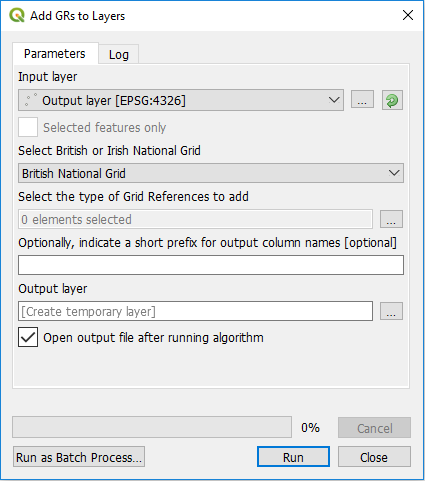
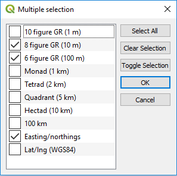

# Add Grid References to Layers Tool for QGIS

This tool was added to the FSC QGIS plugin with version 3.2. It allows you to add British or Irish grid references, of any precision, to a point layer in QGIS. In fact it will also work with any vector layer, using the centroids of features that aren't points, to caclulate the grid references. You can also use the tool to add eastings/northings (British or Irish) or QGS84 lat/lons to layers. This can be useful in a number of situations, e.g. when you've imported waypoints from a GPS unit and you wish to add grid references to them.

Unlike the other tools in the FSC QGIS plugin suite, this one is written using QGIS processing framework, so if you've ever used any tools from QGIS's processing toolbox, this will have a very familiar look and feel about it. Like many processing tools, you first need to select the layer on which you are going to operate (i.e. the one that you want to add the information to). Do this either by selecting an open vector layer from the Input layer drop-down list, or by using the browse button to the right of this ([...]) to work on an unopened vector layer. If you only wish to operate on selected features from an open layer, check the Selected features only box.

If you are adding grid references or easting/northings, you need to specify whether you want to work to the British or Irish national grid system. Select the appopriate value from the Select British or Irish Nation Grid drop-down. It defaults to British.

Under the heading Select the type of Grid References to add, you must click the browse button ([...]) and, in the dialog that appears, select the elements (attributes) that you wish to enrich the vector data with. You can select any number of these, from one to all of them.

Most processing tools, including this one, do not modify the original data, instead they create new layers based on your input layers and selected options. So under Output layer you must either use the browse button ([...]) to specify where in your file system to create the new vector data, e.g. a Shapefile, or you can leave this blank to let the tool generate a temporary layer. Doing the later is quicker and usually more convenient and you can always save the temporary layer to a permanent vector layer afterwards using the standard QGIS features. Usually you will want to leave the Open output file after running algorithm box checked; this will add your results layer to the QIGS layers panel and display it. If you are creating temporary results layer, it makes no sense to uncheck this.

The attributes of your new layer will include all those in the input layer plus new ones based on the selection you made. Optionally you can indicate a short prefix for output column names. This prefix, e.g. an underscore (_) will only be added to the new attributes you are creating. It can be helpful to avoid name clashes with existing attributes.

## Getting help and support

Our GitHub repository is a good place for you to raise issues about problems, bugs, feature requests etc: [https://github.com/FieldStudiesCouncil/QGIS-Biological-Recording-Tools/issues](https://github.com/FieldStudiesCouncil/QGIS-Biological-Recording-Tools/issues)

[(Back to help homepage)](./intro.md)
