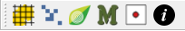
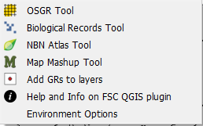

# The FSC Plugin for QGIS

To install the FSC QGIS Plugin, please use the QGIS plugin manager.

The FSC QGIS plugin is designed to make working with biological records in QGIS much easier for UK users, e.g. by:

- dealing with British and Irish national grid references,

- dealing with data structured as biological records (who, what, where & when), and

- visualising and downloading biological records from the NBN Atlas.

Although originally designed to be used in the UK context, many features of the FSC QGIS plugin are useful to international users of biological records too - especially the distribution atlas generation features which can be used with data encoded with any CRS.

The FSC QGIS plugin is installed from the QGIS plugin manager. When installed, you will find a 'FSC Tools' item on the Plugins menu and from this you can start each of the five Tom.bio tools as well as its options dialog. But usually a more convenient way of invoking the tools is from the FSC QGIS plugin toolbar.

There are five main tools and a sixth dialog for managing environment options. The help and info menu item links to this web page. Follow the links below for help on each of these.

- The [OSGR Tool ](./osgr.md)

- The [Biological Records Tool](./biorec.md)

- The [NBN Atlas Tool](./nbn.md)

- The [Map Mashup Tool](./mashup.md)

- The [GR to Layers Tool](./grlayers.md)

- [Environment Options](./env.md)
