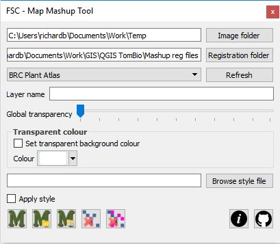
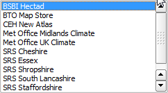
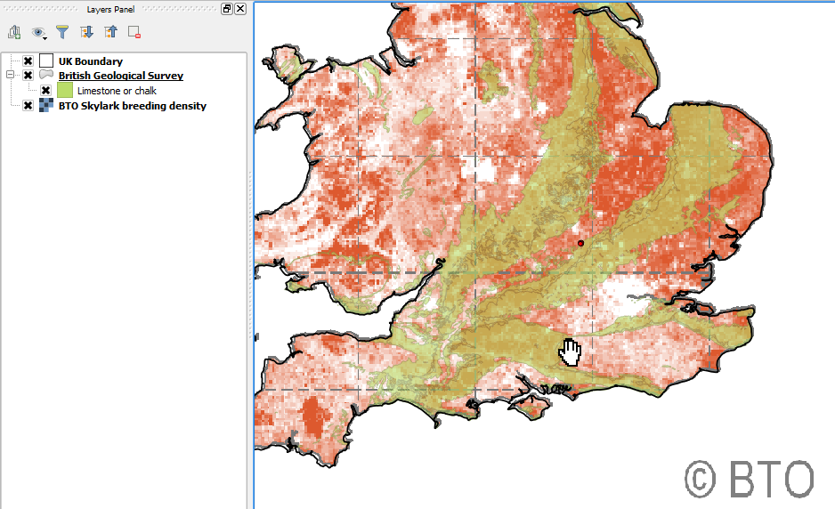
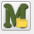
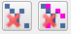

# The Map Mashup Tool for QGIS

There are a great many maps on the internet. They often show information that we would like to use as context to view biological records or other info. Very often this is not possible – the raw data are not downloadable. However, raster images of maps from websites can sometimes be captured and registered in QGIS with a bit of effort and as long as we are using such maps in QGIS for our own learning and not contravening any copyright, this is okay.

Websites that produce a large number of maps, all showing the same part of the earth and with the same projection, are amenable to being used with the Map Mashup Tool. This takes advantage of the fact that once a world file (i.e. raster registration file) is created for one such map – it can be used with any others covering the same area with the same projection.

To start the Map Mashup Tool, click the relevant button on the FSC QGIS plugin toolbar. The tool opens docked on the right-hand side of the map view by default.

At the top of the tool are a couple of text boxes showing the paths to two folders. The image folder is a folder where the temporary raster layers created by this tool are stored. Set the path to this with the button. You can store a default value for this folder in your environment options file (see the mapmashup.imgfolder [environment options](./env.md)).

The Registration folder is where all the world files are kept for the tool. You can store a default value for this folder in your environment options file (see the mapmashup.regfolder [environment options](./env.md)). Any world file in this folder is used to populate the drop-down list immediately below it. If a new world file is added to the folder while this tool is running, use the refresh button to add it to the drop-down list.

If you look at the BTO Map Store website ([https://blx1.bto.org/mapstore/](https://blx1.bto.org/mapstore/)) you can see thousands of maps all showing the same view of the earth (the UK). A world file has been created for one of these maps by georeferencing it in QGIS and a copy of it – renamed BTO Map Store.wld – placed in the registration folder. So, when the drop-down list is expanded, you can see BTO Map Store in the list. If this is selected from the list, then any image copied from the internet and then used in the map mashup tool (see below) will be associated with this world file. So we can grab any map image from the BTO map store and see it in QGIS where we can look at it in relation to any other data that we have.

To grab a map from the BTO Map Store, just copy it to the buffer – also known as the clipboard (in Windows, right-click on the image and select Copy Image from the context menu).

With this image in the buffer and BTO Map Store selected in the map mashup tool, we can just click the paste image from clipboard button the image will be georeferenced according to the world file displayed as a raster layer in the GIS.

Some images can't be copied to the buffer in this way but can be saved to a folder. In this case save the image to the image folder and then use the paste most recent image button to create the raster layer.

Alternatively you can use any image from your file system by using the browse for image image button to select and create the raster layer.

The raster layers created by this tool – like layers created by other Tom.bio tools – are temporary layers. You can use the delete buttons to remove the last, or all of the layers added by the map mashup tool in the current session.

You can set a global transparency for the layer with the slider on the tool (but you can also always change this through the raster layers properties dialog). Likewise you can specify a name for the new layer using the layer name textbox on the too, but again, you can change this after the event in the layers panel.

Sometimes you will want the image you are creating a raster layer for to have a transparent background rather than set global transparency. You may, for example what all the white or black pixels to be transparent. You use the transparent colour controls to do this. Check the checkbox to set a transparent colour and define the colour by selecting with the colour selector control.

Finally, raster layers, like vectors, can save and load external QML file styles. This opens the door to storing more sophisticated transparency and style options for a particular type of image to an external file style. This can be applied on raster layer creation by selecting the style file with the browse style file button and checking the apply style checkbox.

## Where to get the world files

You will find a number of pre-defined world files suitable for use with the map mashup tool in the ExerciseData/MashupWorldFiles folder. You can point your registration folder directly at this folder or you can copy them to another folder on your computer and point to that.

These are some of the world files supplied:

BTO Map Store.wld. You can use this with maps from the BTO map store. ([https://blx1.bto.org/mapstore/StoreServlet](https://blx1.bto.org/mapstore/StoreServlet))

SRS UK.wld. You can use this with the Spider Recording Scheme maps ([http://srs.britishspiders.org.uk/portal/p/A-Z+Species+Index](http://srs.britishspiders.org.uk/portal/p/A-Z+Species+Index)) (Set transparent colour to black.)

If you find a site that produces maps that are suitable for this kind of treatment, you will have to use the raster georeferencer to create a world file, then copy it, giving it a general meaningful name, and put it in the registration folder. Look at the video tutorials below for a demonstration of this process.

## Getting help and support

There are two links at the bottom-right of the tool (shown on the left here). The first links straight from the tool to this web page showing help on how to use the tool. The second link goes straight to the GitHub repository for the FSC QGIS Plugin where you can raise issues about problems, bugs, feature requests etc.

[(Back to help homepage)](./intro.md)
