# The NBN Atlas Tool for QGIS

The NBN Atlas Tool provides an interface from within QGIS to the NBN Atlas via the official [NBN Atlas web services](https://api.nbnatlas.org/). It allows you to incorporate grid maps from the NBN Atlas as QGIS layers so you canvisualise them alongside all your other data. It also provides a handy interface for downloading raw records from the NBN. To start the NBN Atlas Tool, click the relevant button on the FSC QGIS plugin toolbar. By default, this tool opens docked on the right-hand side of the QGIS window.

Species Distribution Maps

The simplest use of the NBN Atlas Tool is to add a layer to the map view showing a distribution map for a particular species from the NBN Atlas. The data from the NBN are provided via a Web Mapping Service (WMS) – the NBN tool provides a short-hand method for specifying calls to the NBN Atlas WMS.

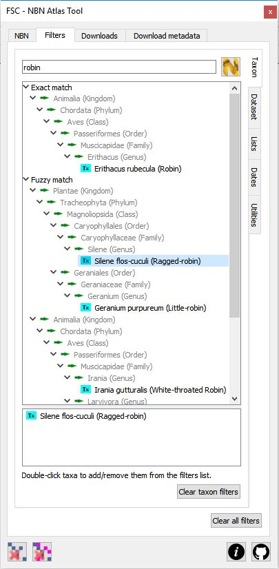To create a WMS map layer for a given species, you must first specify that species. To do this, you go to the filters tab of the tool. Once on this tab you can see, down the right-hand margin of the pane, a second set of tabs which specify different filters. Make sure that the taxon filter tab is selected.

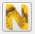First you need to search for the species you are interested in. Type the name of the species (can be vernacular or scientific) into the search box at the top of the tab and either hit theEnter button on your keyboard or click the search the UK species inventory button. All taxa matching your search query are shown in the top list grouped taxonomically under two nodes - exact match and fuzzy match. Taxa that match your search term exactly (common or scientific name) are shown under the exact match node - all others are show under the fuzzy match node. Expand these nodes to find the taxa you are interested in. To select a taxon to use as a filter, double-click it from this list - it will appear in the list below which shows all the selected taxa. Note that you can select multiple taxa (carrying out different searches to find them if necessary) but for the web mapping service, you must only select one. (Multiple selections can be handled by downloading - see later.)

The illustration on the right shows the result of a search on the term 'robin' with a single taxon - the plant Ragged-robin - actually selected (it is present in the bottom list).

Go back to the main NBN tab. Notice that in the list of specified filters, the species checkbox is checked. At this point you are ready to generate an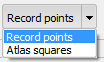NBN Atlas WMS layer for the species. Before you do that you can specify some styling options for the WMS layer generated by the Atlas. Most fundamentally you have to decide whether you want to represent individual records as points on the map or aggregate them as an 'atlas' style map. Do that by selecting the appropriate value from the drop down list.

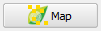To generate the layer(s) you just click the map button. As well as the taxon filter, which must be specified, you can also use other filters with this button. You can add filters for dataset (or data provider), date and polygon. (See the section below on specifying other filters.)

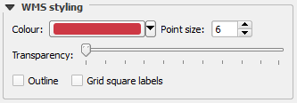You can also specify a number of other style options. The colour picker allows you to specify the colour used to generate record points or atlas squares. You can set the transparency of the WMS layer using the slider. You can indicate whether or not the record dots or atlas squares are to be outlined by checking or un-checking the outline checkbox. If you specify record points, then you can specify the size of the dots used to represent records by setting the value of point size. If you specify atlas squares, you can indicated whether or not to display labels on the atlas squares to display the corresponding grid reference.

Of all the style options specified above, only the transparency can be changed once the WMS layer is specified (via the layer properties dialog). To change any of the other style properties, you will have to delete the WMS layer, change the desired property and then regenerate it.

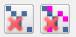All of these layers can be generated very quickly and you can soon end up with a lot of WMS layers in the layers panel. The two delete buttons allow you to remove these layers quickly. The remove last NBN Atlas WMS layer button on the left simply removes the last generated layer. The remove all NBN Atlas WMS layers button on the right removes all of them.

WMS limitations - there is currently no way to use the NBN Atlas web service from within QGIS to produce maps for sub-species. Distribution maps can only be produced for taxa recorded at the following ranks: phylum, class, order, family, genus and species. This tool relies on a number of NBN Atlas web services which could, on rare occasions, be unavailable, resulting in unexpected behaviour.

Downloading NBN Atlas Data

The second major feature of this tool is the facility to download raw records from the NBN Atlas based on a range of selection criteria (filters). (You can these use the plugin's Biological Records Tool to generate vector layers from these raw records.)

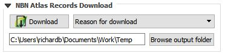To download records from the NBN Gateway, you specify one or more filters and then click the download button. To download records, you must have at least one of either taxon, dataset (or data provider), species list or polygon filters specified. Optionally you can also specify date filters. You can specify any combination of filters so long as the minimum is satisfied. (See the section below on specifying filters.) You must specify a folder where downloaded files will be stored, either by selecting it with the Browse output folder button or by setting the nbn.downloadfolder environment variable. Using the environment variable is the preferred way since it means that you will not have to browse to the folder every time you start the tool. Finally, you need to specify a reason for your download from the dropdown list (e.g. 'education' or 'ecological research' or 'citizen science').

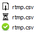Depending on the amount of data being downloaded and the bandwidth of your internet connection, downloading data can take some time. So that you can carry on using QGIS and the plugin while this is happening, downloads happen 'in the background'. You can follow the progress of a download on the downloads tab. Here you will see the name you provided for the CSV file and an icon indicating the progress on the download. The top of the three images shown here indicates that the data are still being downloaded from the NBN. The next image indicates that the file is being written to your computer and the last – the tick in the green circle – indicates that the download completed successfully. If the download fails for any reason, it is shown with a red cross icon.

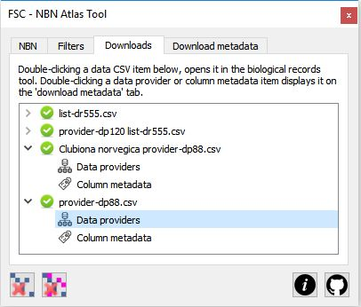Note that large datasets may take some time to download. If downloads time out, you may want to change QGIS's timeout limit. In QGIS Settings->Options->Networks, increase the value of the Timeout for network requests property from the default value of 60000 milliseconds (60 seconds, i.e. one minute), to something like 600000 milliseconds (600 seconds, i.e. 10 minutes).

Once a CSV file has been downloaded from the NBN it can be opened and mapped in QGIS using the biological records tool as previously described. To quickly open the CSV file in the biological records tool, all you have to do is double-click on the 'green tick' icon representing the successful download in the NBN tool. Underneath the green tick icon you will see another couple of icons that represent metadata files that are downloaded from the NBN at the same time as the CSV file: one lists the data providers for the data you have downloaded and the other describes the fields in the CSV file. Both of these files are saved alongside the CSV file in the download folder, but to quickly examine their contents, simply double-click on the icon; the contents of the corresponding file will be displayed in a table on the download metadata tab.

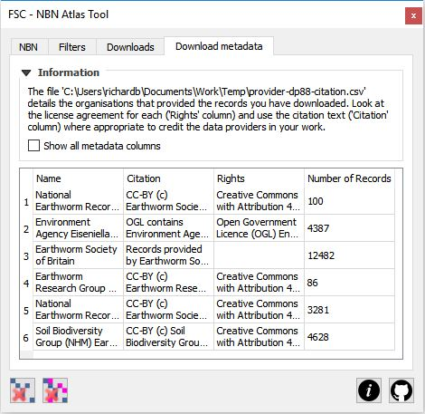You should note the licensing options specified under the citation and rights columns for the various data providers. Consult the full [NBN Atlas Terms of Use](https://docs.nbnatlas.org/nbn-atlas-terms-of-use/) for more information on how data from the NBN Atlas can and can't be used.

Filter specification

We've already covered how to set the taxon filter. Note that for downloading data, you can specify several taxa concurrently. Here we'll look at using the other filters available from the main filters tab. The various filters are reached from a sub-set of tabs arranged down the right-hand side of the filters tab.

On the dataset tab, all the NBN data providers are listed. If you click on any provider, a list of all datasets supplied by that data provider is downloaded from the NBN Atlas and displayed underneath the provider. To select a dataset, simply check the box adjacent to its name. To select all the datasets for a particular provider, you can check the box next to the provider's name. If you cannot see the name of a data provider that you expect to be there, click the refresh list button to make sure that you have the latest list from the NBN Atlas. You can use the clear dataset filters button to quickly un-check all datasets.

On the lists tab, a number of species lists stored within the NBN Atlas are listed under grouping supplied by the NBN Atlas. Selecting a species list will uses all of the taxa within that list as a filter for downloads. Unfortunately the NBN Atlas does not provide a way to see what species are included in any given list, so use these with caution. To select a species list, simply check the box adjacent to its name. If you cannot see the name of a species list that you expect to be there, click the refresh list button to make sure that you have the latest list from the NBN Atlas. You can use the clear species list filters button to quickly un-check all species lists.

On the dates filter tab, you can filter records based on a year range. Check the relevant boxes to filter records after and/or before a certain year which you set using the 'spinner' controls to the left of the checkboxes.

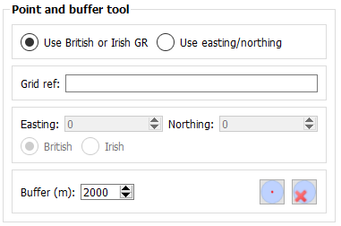The utilities tab doesn't have any filters on it, but it does have a utility that can be used to generate polygons to use as filters. The point and buffer tool lets you create a circle (a polygon) which can be used as a filter. This tools generates a circle based on a centre point (specified by a grid reference or easting northing) and a buffer in metres. Specify the relevant parameters and click the generate button. This create a temporary map layer with the circle which, like any other map feature, can be used as a filter for downloads as described below. Adjacent to the generate button is another which allows you to quickly delete any such temporary layer.

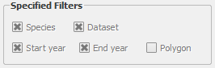You can, in theory, use a polygon from any displayed vector layer as a filter for an NBN Atlas download. All you need to do is select it. When you select a single feature in the map view, you will see the polygon checkbox under the specified filters on the main NBN tab is checked. That means that only records that overlap that polygon will be included in downloaded records from the NBN.

Large polygons with many vertices may exceed the limit that can be used with the web services. Furthermore, complex polygons may included 'unclean' geometry which could cause the web service call to fail. Simple polygons - e.g. those representing a grid square or a buffered point - are normally fine. With other polygons, you just have to try and see if they can be used as a filter. You can quickly clear all filters by clicking the clear all filters button on the filters tab.

Tip: Always check the specified filters on the main NBN tab before kicking off a download to make sure that you have only specified the filters that you think you have.

Getting help and support

There are two links at the bottom-right of the tool (shown on the left here). The first links straight from the tool to this web page showing help on how to use the tool. The second link goes straight to the GitHub repository for the FSC QGIS Plugin where you can raise issues about problems, bugs, feature requests etc.

[(Back to help homepage)](./intro.md)
