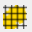
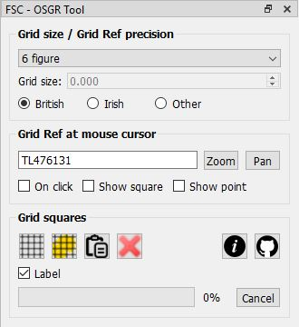
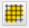
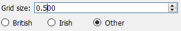

# The OSGR Tool for QGIS

QGIS is international in scope and not specifically geared up for the UK context. Although it handles the British-specific CRSs very well, it does not handle the unique OS grid referencing system that we have in the UK. This means that although it understands eastings and northings perfectly well, e.g. the location of the FSC Preston Montford bar which is easting 343292 and northing 314369, it doesn't understand the equivalent 10 figure grid reference, which is SJ4329214369.

But biological recorders and GIS users operating in the UK and Ireland frequently need to deal with OS and Irish grid references, e.g. to centre a map on a given grid reference or to find the grid reference at a certain point and creating grids corresponding to OS or Irish grid squares. The QSGR Tool provides these functions to QGIS users, but it also provides some functionality relevant to users who work in other parts of the world.

To start the OSGR Tool, click the relevant button on the FSC QGIS plugin toolbar. By default, the OSGR Tool docks initially at the bottom left of the QGIS window (below the layers panel if you have that opened and docked on the left-hand side).

The grid reference at the current mouse cursor position is displayed in the tool. By default, this changes as the mouse moves, but this behaviour can be altered so that it changes only when the mouse is clicked in the map view by checking the on click checkbox. If the show square checkbox is checked then the grid square corresponding to the displayed grid reference is shown in the map view. The precision of the grid reference displayed is controlled by the drop-down list at the top of the tool.

You can also use the tool to locate the map at a specified grid reference. To do so, type a grid reference into the area where the grid reference is normally displayed and click either the zoom or pan button to the right of it. The zoom button fills the entire map view with the grid square you specified, but pan sinply recentres the map on the centre of the specified square without changing the zoom level.

If you are working with British grid references, select the British radio button. If you want to work with Irish grid references, select the Irish option. If you select the other radio button, then you can specify a user-defined grid size in units corresponding to the units of the currently defined CRS of the map view (also called the 'project' CRS), e.g. metres or decimal degrees. There are no grid references associated with this, but if you select the show square option you will be able to see the location of grid squares of the specified size on the map.

The other function of this tool is to generate grids aligned to the British or Irish National Grids (or those for other CRS). To generate a grid, set the precision drop-down list at the top of the tool to indicate what size squares you want in the grid. Next engage the grid drag tool button (bottom left of the tool) and drag a rectangle on the map view over the area of interest. Make sure that you have selected the radio button that corresponds to your grid system of choice: British Irish or other (see below for the latter).

The tool button to the immediate right of this performs a very similar function except that it only generates grid squares that overlap a selected feature. So to use this, first select the feature(s) over which you wish to generate the squares and then click the button. Don't forget that the layer from which you select the feature must be 'active' (i.e. selected in the layers panel) before you click this button.

The grid squares generated by this tool go into a temporary map layer called OSGR grid squares. An attribute (GridRef) stores the grid reference of each square. This can be used to label the layer in the normal way, but a quick shortcut to displaying this as a label is to check the label checkbox on the tool.

International users: to generate grids based on CRSs other than British National Grid, you must select other from the grid size radio buttons and then specify a size for the grid. The dimension you specify should be in the units associated with the CRS of the map view (i.e. project CRS), e.g. metres or degrees. Make sure you specify the size in the correct units otherwise the results will not be as you expect. For example, if you want to create a grid based on WGS84, you must first ensure that the projection of your map view is set to WGS84 (EPSG: 4326) and the grid size is set to something sensible such as 0.5. This will give you a grid of dimension 0.5 decimal degrees.

You can clear the temporary grid layer out quickly by clicking the delete button on the right of the tool. The tool is designed to let you generate these temporary grids extremely rapidly on the fly. But if you save a project with a temporary grid in, it won't be there when you open the project again. So if you want to save a grid you have created, you will need to use the QGIS layer>save as function to save a copy of the layer to a permanent shapefile.

A really quick way of locating a bunch of Irish or British grid references (including mixtures of both) in QGIS is to use the paste GR button. From any source suuch as a spreadsheet, Word document, website or PDF, highlight text containing the grid references you wish to locate and copy to the clipboard (buffer), e.g. by using [CTRL]-C on a Windows computer. It doesn't matter how much other non-GR stuff is in with the text you copy. Now click the paste button in the OSGR tool and the squares corresponding to the grid references will be created in the temporary grid layer. For this to work, your grid references must not have any spaces within them, e.g. it won't work with 'SD 6414' or 'SD64 14' - it must be 'SD6414'.

Getting help and support

There are two links at the bottom-right of the tool (shown on the left here). The first links straight from the tool to this web page showing help on how to use the tool. The second link goes straight to the GitHub repository for the FSC QGIS Plugin where you can raise issues about problems, bugs, feature requests etc.

[(Back to help homepage)](./intro.md)
